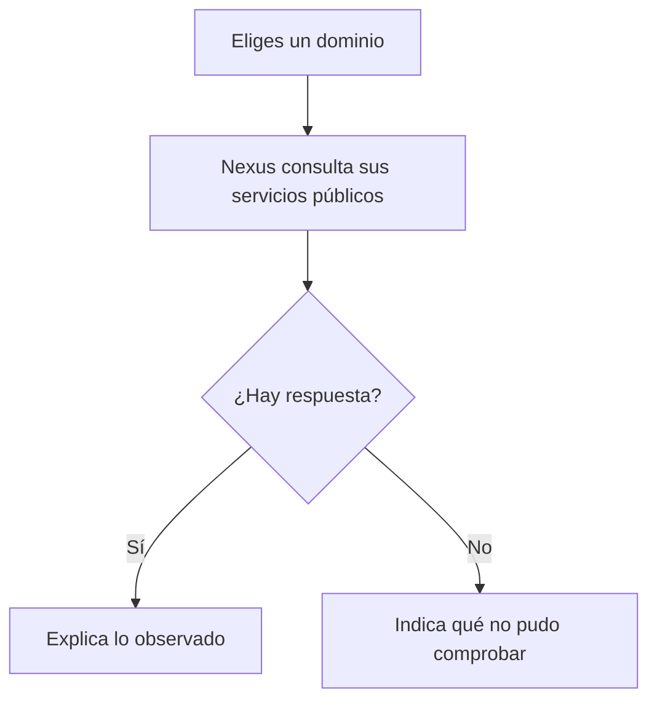

# Nexus Intelligence

Conoce qué responde la web y el correo de un dominio que administras. Nexus consulta sus direcciones, su página, su certificado y algunos nombres relacionados. Después guarda un informe que explica qué encontró y qué queda por revisar.

[Ver comprobaciones](https://github.com/genesisgzdev/nexus-intelligence/actions) · [Guía de uso](docs/USO.md) · [Cómo funciona](docs/ARCHITECTURE.md)

## Tu primera consulta

Necesitas Python 3.11 o posterior y conexión a internet. Descarga el repositorio, abre una terminal en su carpeta y crea un entorno:

```sh
python -m venv .venv
```

Actívalo con `.venv\Scripts\activate` en Windows o `source .venv/bin/activate` en Linux y macOS. Instala Nexus y ábrelo:

```sh
python -m pip install .
nexus-intel
```

Nexus te preguntará qué dominio quieres consultar. Escribe solo el dominio, sin `https://` ni una ruta, y pulsa Enter. Utiliza dominios propios o para los que tengas autorización.

También puedes ir directamente a una consulta:

```sh
nexus-intel midominio.com
```

Sustituye `midominio.com` por tu dominio. Las respuestas proceden de la red en ese momento.

## Qué vas a recibir

La terminal muestra un resumen y la ubicación del informe. Abre el archivo Markdown de la carpeta `reports` para leerlo y despliega «Ver los datos de esta consulta» cuando necesites el detalle.

| Consulta | Para qué te sirve |
| --- | --- |
| Direcciones del dominio | Ver a qué direcciones de red responde |
| Página web | Saber si contestó y revisar su configuración visible |
| Certificado de conexión | Leer los datos del certificado presentado |
| Correo del dominio | Revisar servidores y registros contra suplantación |
| Otros sitios del dominio | Encontrar nombres de la lista que Nexus consulta |

El certificado se lee sin verificar su autenticidad en ese módulo. Una respuesta web correcta tampoco demuestra que un sitio sea seguro. Si una consulta queda incompleta, el informe lo dice.



## Revisar varios dominios

Guarda uno por línea en un archivo llamado `dominios.txt` y ejecuta:

```sh
nexus-intel --file dominios.txt --concurrency 5 --correlate
```

Recibirás informes individuales y un resumen de observaciones parecidas. Los nombres repetidos se consultan una sola vez por archivo. Puedes añadir comentarios en líneas que comiencen por `#`.

Las similitudes ayudan a elegir qué revisar. No atribuyen una amenaza ni demuestran que dos dominios pertenezcan a la misma persona.

## Si necesitas ayuda

La [guía de uso](docs/USO.md) explica los mensajes, dónde quedan los archivos y cómo ajustar tiempos y capacidad. `nexus-intel --help` muestra los comandos. `--verbose` añade mensajes técnicos para diagnosticar una consulta.

Para desarrollar, usa `uv sync --frozen --extra dev` y `uv run pytest -q`. El [mapa de archivos](docs/REPOSITORY_MAP.md) indica dónde está cada función.

Licencia [MIT](LICENSE).
