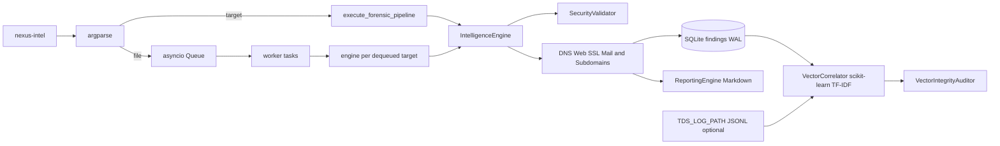
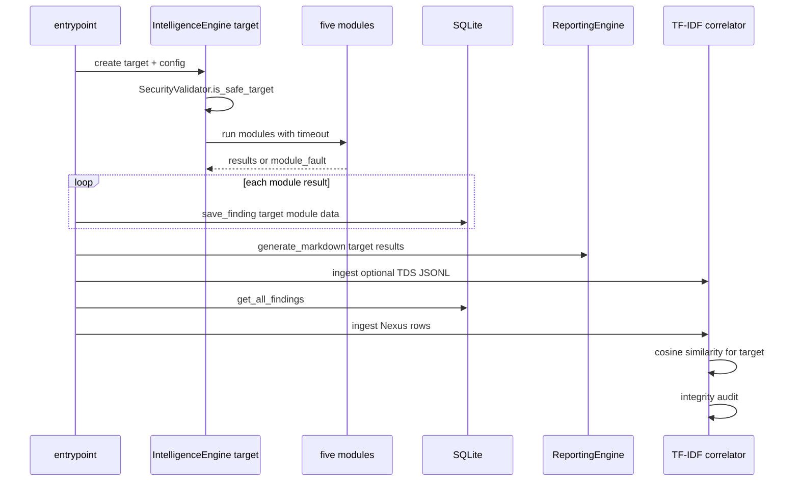
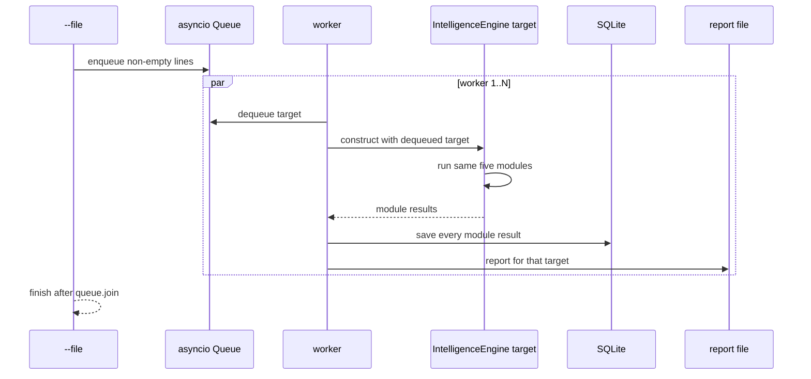

# Nexus Intelligence architecture

Nexus no es una API remota: es un proceso CLI que ejecuta módulos de red, guarda observaciones locales y construye correlación TF-IDF en memoria.

## Cómo leerlo

La primera figura muestra los componentes conectados. Las dos secuencias separan objetivo único y archivo bulk porque terminan con análisis distintos. La sección final explica cómo interpretar un hallazgo.

## 1. Componentes reales

El runtime no declara Redis, MongoDB ni Milvus. La persistencia activa es SQLite y la correlación activa es TF-IDF local.

## 2. Objetivo único

## 3. Archivo bulk

El bulk ejecuta y persiste cada objetivo. Con `--correlate`, después de que termina la cola, el proceso reconstruye el índice desde SQLite y genera un resumen de pares similares entre objetivos distintos; sin esa opción solo produce los informes individuales. `--concurrency` se limita a `NEXUS_MAX_CONCURRENT`; los fallos de un módulo quedan como `module_fault` y no cancelan los otros módulos.

Los módulos HTTP usan redirects manuales con un máximo de cinco saltos. Cada destino debe ser HTTP(S), no puede incluir credenciales y vuelve a pasar por `SecurityValidator`. La solicitud se construye con la IP pública validada y un encabezado `Host` con el nombre original para evitar que `curl_cffi` vuelva a resolver el hostname. TLS conecta contra la IP validada con el hostname original como SNI y cierra el writer aunque falle la extracción del certificado. SMTP valida cada MX, limita tanto la conexión como la lectura del banner y cierra el writer incluso cuando la respuesta falla. La enumeración de subdominios valida las direcciones A de cada respuesta antes de incluir el nombre en el informe.

## 4. Datos y evidencia

- SQLite almacena `target`, `module`, JSON serializado y timestamp mediante queries parametrizadas.
- Los reportes escapan encabezados y JSON observados, usan nombres de archivo acotados por slug y hash y se escriben con permisos `0600`.
- La base activa `journal_mode=WAL`, usa `busy_timeout` y serializa las escrituras dentro de cada `PersistenceManager`.
- DNS, TLS, HTTP, SMTP y subdominios dependen de respuestas de red en ese momento. Una ausencia o timeout es una observación incompleta, no una conclusión de seguridad.
- `tests/test_runtime.py` cubre mail SPF/DMARC, wildcard, persistencia, correlación, JSONL malformado, integridad TF-IDF y el target correcto en bulk.
- Un corpus sin vocabulario útil no aborta la ingesta: el correlador conserva `index_error` y devuelve resultados vacíos hasta que haya señales comparables.
