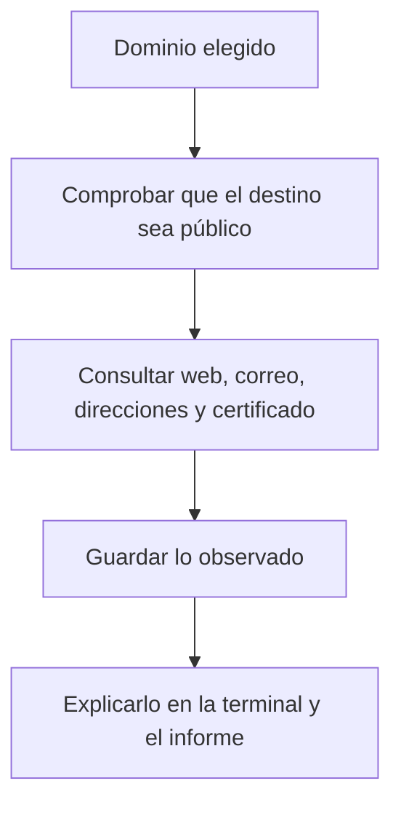

# Cómo obtiene y explica datos Nexus

Nexus es un programa que corre en tu equipo. Consulta servicios públicos, guarda lo observado y genera informes. El resumen y los datos desplegables proceden de las mismas respuestas.

## Una consulta

```mermaid
flowchart TD
    A["Dominio elegido"] --> B["Comprobar que el destino sea público"]
    B --> C["Consultar web, correo, direcciones y certificado"]
    C --> D["Guardar lo observado"]
    D --> E["Explicarlo en la terminal y el informe"]
```

Los módulos se ejecutan en paralelo con un tiempo de espera. Si uno falla, se guarda ese fallo y se aprovechan las respuestas de los demás. El código de salida conserva esa diferencia; un informe parcial no se convierte en una ejecución correcta por tener una presentación más clara.

| Pieza | Responsabilidad |
| --- | --- |
| `__main__.py` | Elegir dominio o archivo y dirigir la consulta |
| `core/engine.py` | Validar el destino y ejecutar módulos |
| `core/orchestrator.py` | Repartir dominios entre trabajos paralelos |
| `core/persistence.py` | Guardar las observaciones en SQLite |
| `core/presentation.py` | Explicar lo observado sin inventar una conclusión |
| `core/reporting.py` | Escribir un informe único con el detalle desplegable |

## Consultar sin cambiar de destino a escondidas

Antes de conectar, Nexus resuelve el nombre y comprueba las direcciones obtenidas. La conexión se fija a una dirección pública validada. HTTP conserva el nombre original para el servidor y TLS para la identificación de la conexión.

Las redirecciones HTTP se revisan una por una, con un máximo de cinco. No se admiten credenciales dentro de la URL. El correo vuelve a comprobar el destino de cada servidor antes de abrir la conexión. Estas comprobaciones impiden usar una respuesta de DNS o una redirección para llevar el programa a una red interna.

La resolución, conexión y lectura tienen tiempos de espera. Las conexiones se cierran también cuando falla la consulta. El módulo de certificado recoge sus datos, pero señala `certificate_verified: false`; leerlo no verifica su autenticidad.

## Varios dominios

El archivo acepta un dominio por línea y comentarios que empiezan por `#`. Se eliminan duplicados conservando el orden. Un archivo vacío o ilegible produce un error antes de crear trabajo.

Cada trabajo construye un motor para su propio dominio. El número de trabajos se comprueba frente a `NEXUS_MAX_CONCURRENT`. Puedes aumentar esa configuración; una cantidad mayor también consume más red y memoria.

Con `--correlate` se comparan los textos de las observaciones almacenadas para esos dominios. TF-IDF es la técnica que pondera palabras según su frecuencia; la similitud sirve para encontrar observaciones parecidas. No es un veredicto ni una atribución de amenazas. El archivo opcional `TDS_LOG_PATH` añade eventos de TDS al texto comparable.

## Datos completos y datos parciales

| Situación | Cómo se comunica |
| --- | --- |
| Un módulo no termina | Se guarda su error y la ejecución devuelve 1 |
| Una página supera 2 MiB | Se marca `body_truncated` |
| La comparación alcanza dos millones de pares | Se marca `correlation_truncated` |
| No hay vocabulario útil para comparar | El índice guarda el problema y devuelve coincidencias vacías |
| DNS o correo no responden | La explicación evita concluir que esos servicios no existen |

SQLite guarda dominio, módulo, respuesta y fecha mediante consultas parametrizadas. Usa su registro de escritura WAL y espera ante bloqueos breves. El informe tiene un nombre independiente para cada consulta y se crea de forma privada. Los datos observados se escapan antes de incorporarlos al documento. En la terminal no se interpretan como instrucciones de formato Rich.

Los mensajes técnicos se conservan en archivos y se muestran con `--verbose`. Los resúmenes visibles no sustituyen esos datos.

## Comprobaciones

Las pruebas verifican destinos públicos, redirecciones, cierre de conexiones, correo, persistencia, informes, comparación y el dominio elegido en cada trabajo. Las nuevas pruebas comprueban que un certificado leído no aparezca como verificado y que un archivo sin dominios no se acepte como una consulta completa.

[Guía de uso](USO.md) · [Mapa de archivos](REPOSITORY_MAP.md)
